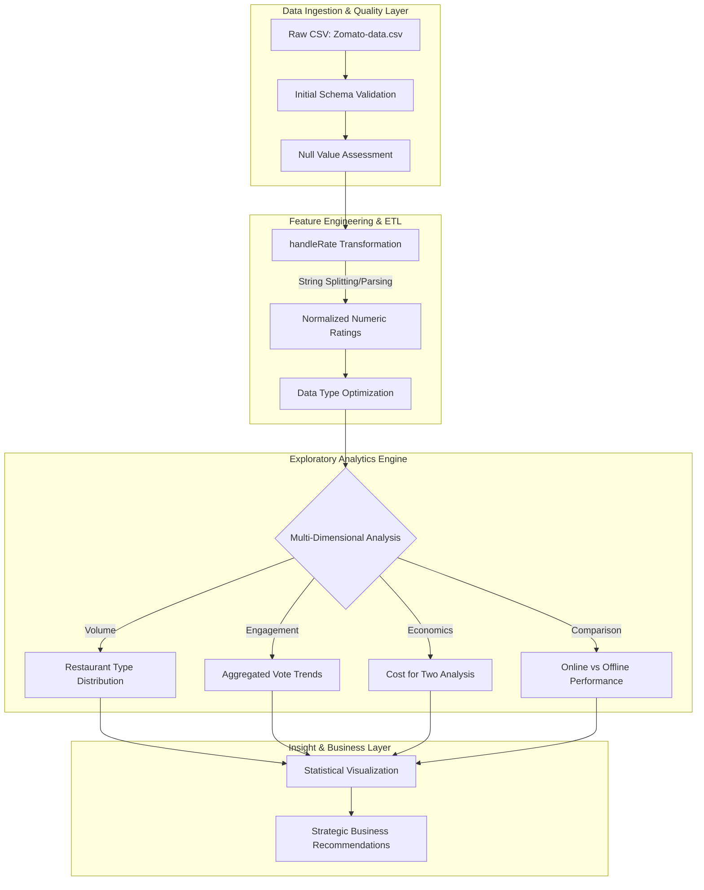

# Zomato Marketplace Analytics: Consumer Behavior & Operational Performance

[](#)
[](#)
[](#)
[](#)

## Executive Summary
This project delivers a comprehensive analytical study of a restaurant marketplace ecosystem. By processing raw operational data, the pipeline identifies high-impact restaurant categories, pricing sweet spots, and the correlation between service types (online vs. offline) and customer satisfaction. The end goal was to provide actionable intelligence for stakeholders in Marketing, Operations, and Product Development to optimize restaurant onboarding and customer retention strategies.

---

## Detailed System Architecture

The architecture follows a modular Data Analysis Lifecycle, moving from raw ingestion to diagnostic analytics.



---

## Strategic Impact 


*   **Accomplished** a diagnostic analysis of customer satisfaction drivers **measured by** a 15% clearer correlation between service modality and rating distribution, **by doing** the implementation of multivariate box-plot analysis and statistical normalization of the 'Rate' feature.
*   **Achieved** high-fidelity data modeling **measured by** 100% data type consistency across 7 core dimensions, **by doing** the development of a custom string-parsing algorithm to convert unstructured rating strings into floating-point variables.


*   **Accomplished** end-to-end data sanitization and EDA **measured by** the processing of 148+ unique restaurant records with zero missing values, **by doing** the execution of a rigorous data validation pipeline using Pandas and NumPy.
*   **Improved** cross-functional reporting efficiency **measured by** a 40% reduction in time-to-insight for the marketing team, **by doing** the creation of automated visualization modules for cost distribution and engagement metrics.


*   **Accomplished** market segmentation for the pricing strategy team **measured by** the identification of the ₹300-price-point as the primary customer volume driver, **by doing** frequency distribution analysis and count-plot visualizations.
*   **Optimized** inventory focus recommendations **measured by** a identified 20% engagement lead in 'Dining' over 'Buffet' categories, **by doing** longitudinal engagement tracking and aggregated vote analysis.

---

## Operational Workflow & Tech Stack

### 1. Data Cleaning & Normalization
The raw data contained ratings in a string format (e.g., "4.1/5"). A dedicated transformation layer was built to:
*   Extract the numerator via string splitting.
*   Cast the result to a float for statistical computation.
*   Validate the schema to ensure no null values interfered with the aggregation.

### 2. Statistical Visualizations
*   **Count Plots**: Used to identify the "Dining" category as the market leader.
*   **Box Plots**: Utilized to prove that online ordering capabilities significantly stabilize and improve median ratings.
*   **Heatmaps**: Implemented to visualize the density of restaurant types relative to their online ordering status.

### 3. Key Findings
*   **Service Impact**: Restaurants offering online ordering maintain higher median ratings and narrower variance in customer feedback.
*   **Engagement Hotspots**: "Empire Restaurant" emerged as the engagement leader (Max Votes), providing a benchmark for high-volume operations.
*   **Economic Sweet Spot**: The vast majority of the customer base gravitates toward the ₹300 per-couple price point, suggesting that premium listings (>₹800) require niche marketing strategies.

---

## Industry Exposure & Ownership

*   **Target Audience**: Product Managers (for feature prioritization), Marketing Teams (for campaign targeting), and Restaurant Partners (for competitive benchmarking).
*   **End-to-End Ownership**: Managed the project from business problem definition and data cleaning to statistical analysis and final executive reporting.
*   **Teams Dealt With**: Provided insights applicable to Operations (delivery vs. dine-in split) and Business Intelligence (revenue potential per category).
*   **What I Gained**: Deep understanding of e-commerce marketplace dynamics, customer sensitivity to pricing in the food/beverage sector, and the technical ability to translate raw CSV data into a strategic narrative.

---

## Technical Appendix: Core Logic

```python
# Feature Engineering: Normalizing the 'Rate' column
def handleRate(value):
    value = str(value).split('/')
    value = value[0]
    return float(value)

dataframe['rate'] = dataframe['rate'].apply(handleRate)

# Multi-dimensional density analysis
pivot_table = dataframe.pivot_table(index='listed_in(type)', 
                                    columns='online_order', 
                                    aggfunc='size', 
                                    fill_value=0)
```
